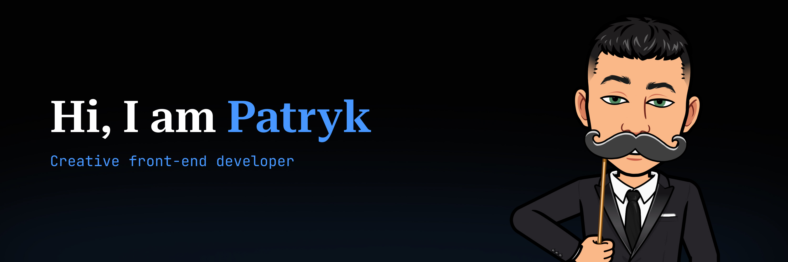
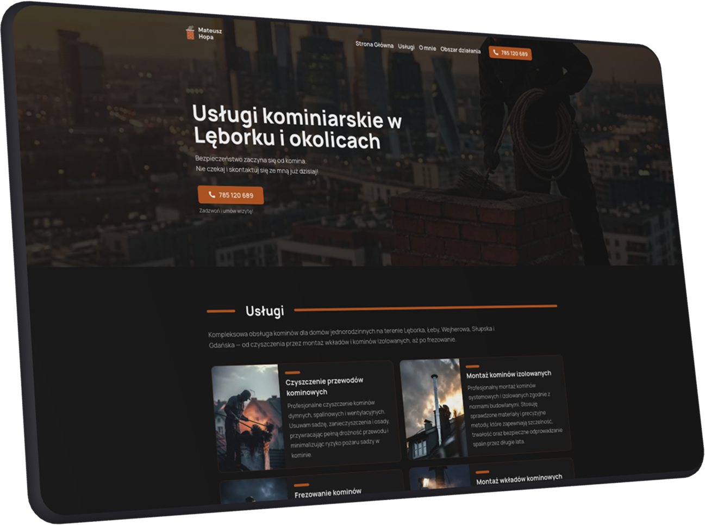
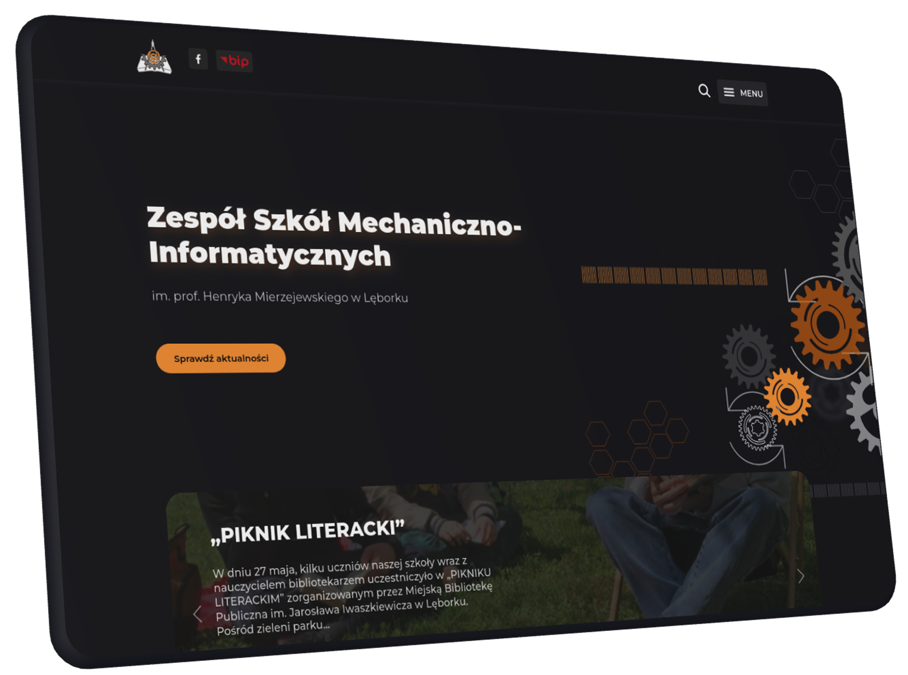
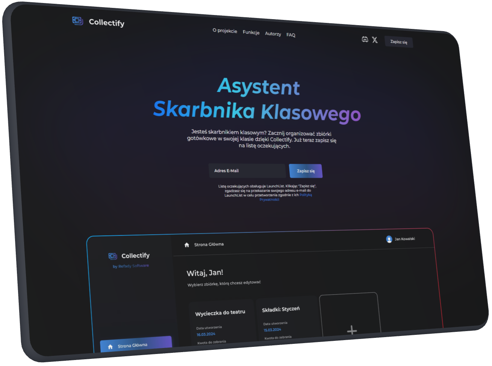
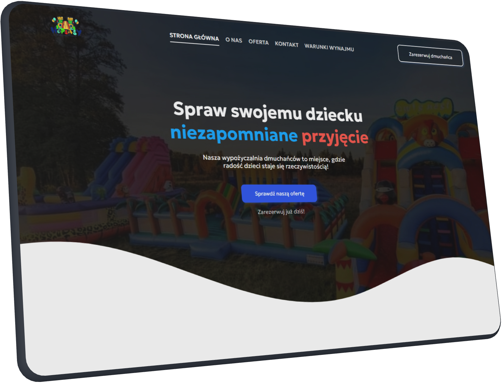

# Hello! I am Patryk.

I am a programming technician and I constantly develop my programming skills. My main area of interest is building websites, especially front-end development, but I do not limit myself to it and I am always open to different technical challenges.

I enjoy challenges and I am always looking for new ways to become better at what I do. I continuously expand my knowledge, and in my daily work I consciously use AI tools to optimize processes, both professional and personal. I care about working efficiently and thoughtfully.

I also run a blog where I write about self-development, time management, and productivity, topics that are just as important to me as programming. I believe that a good developer is not only someone who writes clean code, but also someone who can manage their time and energy wisely.

If you are looking for someone to build a website or need support in programming, feel free to get in touch. I will gladly answer your questions and help you bring your projects to life.

## If you speak Polish...

I write a blog in Polish about self-development, time management, productivity, and building better work habits.

  

## Main Skills

                  

## Productivity Tools

           

## Featured Projects

<table>
  <tr>
    <td width="250" valign="top">
      
    </td>
    <td valign="top">
      <h3>Chimney Sweep Mateusz Hopa</h3>
      

        
        
        
        
      

      
Website for a chimney sweep company from Lębork, Poland. I designed the interface and implemented it in code, wrote SEO-optimized content for local search, and set up Sanity CMS for content management.

      

    </td>
  </tr>
  <tr>
    <td width="250" valign="top">
      
    </td>
    <td valign="top">
      <h3>ZSMI.PL</h3>
      

        
        
        
        
        
      

      
A modern school website with bold colors and a unique style. I designed the layout, developed a custom WordPress template, optimized accessibility for people with disabilities, and implemented SEO.

      

    </td>
  </tr>
  <tr>
    <td width="250" valign="top">
      
    </td>
    <td valign="top">
      <h3>Collectify</h3>
      

        
        
        
        
        
        
        
        
      

      
Collectify is your solution for perfectly organizing cash collections in the classroom. This application was created for class treasurers who want to organize the process of collecting money from all students.

      

    </td>
  </tr>
  <tr>
    <td width="250" valign="top">
      
    </td>
    <td valign="top">
      <h3>Hopsasy.pl</h3>
      

        
        
        
      

      
Hopsasy.pl is a dedicated website created especially for an inflatable rental company in Lębork. The website allows users to explore the wide range of inflatables offered and easily get in touch to use the services.

      

    </td>
  </tr>
</table>

## Contact

Open to collaborations, freelance work, and technical consulting.

  
  
  

  
  
  

## GitHub Stats

  
  

  

